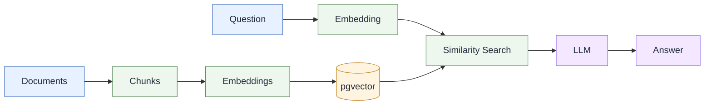

# RAG AWS SAA

A **Retrieval-Augmented Generation (RAG)** API built with **.NET 10, PostgreSQL, pgvector, and OpenAI**.

I chose **RonitSachdev’s AWS SAA-C03 Guides** as the corpus because I found them helpful while preparing for and passing the certification. The guides are licensed under **CC BY 4.0**; see the [original repository](https://github.com/RonitSachdev/aws-saa-c03-guides) and [LICENSE](https://github.com/RonitSachdev/aws-saa-c03-guides/blob/main/LICENSE).

## How It Works

1. **Read** — Load Markdown documents.
2. **Chunk** — Split documents into smaller sections.
3. **Embed** — Generate OpenAI vector embeddings.
4. **Store** — Save chunks and embeddings in PostgreSQL + pgvector.
5. **Retrieve** — Find relevant chunks using vector similarity.
6. **Generate** — Send retrieved context to an LLM.



## API

```text
GET /ingest
GET /search?q=...
GET /ask?q=...
```

`/ingest` clears existing chunks and re-ingests the document corpus.

## API Example

Ask a question using the `/ask` endpoint:

```http
// "What is the difference between Multi-AZ and Read Replicas?"
GET /ask?q=What%20is%20the%20difference%20between%20Multi-AZ%20and%20Read%20Replicas?
```

Example response:

```json
{
  "question": "What is the difference between Multi-AZ and Read Replicas?",
  "answer": "Short answer — they solve different problems:\n\n- Purpose\n  - Multi‑AZ: availability/DR (spare tire for failures).\n  - Read Replicas: read scaling/performance (extra checkout lanes).\n\n- Replication\n  - Multi‑AZ: synchronous — standby is always exactly current.\n  - Read Replica: asynchronous — can have slight lag.\n\n- Location & count\n  - Multi‑AZ: single standby in another AZ.\n  - Read Replica: up to 15; can be same AZ, cross‑AZ, or cross‑region.\n\n- Can you read from it?\n  - Multi‑AZ standby: No — invisible until failover.\n  - Read Replica: Yes — read‑only endpoints.\n\n- Failover\n  - Multi‑AZ: automatic (60–120s) via DNS flip.\n  - Read Replica: no automatic failover — promotion is manual.\n\n- When to use\n  - Multi‑AZ: survive AZ/hardware failure.\n  - Read Replica: offload read/reporting workloads.\n\nCommon pitfalls: don’t try to serve reads from the Multi‑AZ standby, and don’t expect read replicas to provide automatic failover. Production often uses both.",
  "sources": [
    {
      "filePath": "topic-guides/09-RDS-Aurora.md",
      "section": "The idea",
      "chunkIndex": 1
    },
    {
      "filePath": "topic-guides/09-RDS-Aurora.md",
      "section": "The idea",
      "chunkIndex": 2
    },
    {
      "filePath": "topic-guides/09-RDS-Aurora.md",
      "section": "Question patterns",
      "chunkIndex": 0
    },
    {
      "filePath": "topic-guides/09-RDS-Aurora.md",
      "section": "Pocket card",
      "chunkIndex": 0
    },
    {
      "filePath": "topic-guides/02-S3.md",
      "section": "Lifecycle, versioning, replication",
      "chunkIndex": 1
    }
  ]
}
```


## Environment Variables

```bash
export ConnectionStrings__RagDatabase='...'
export OPENAI_API_KEY='...'
```

## Author

Jorge Donoso
