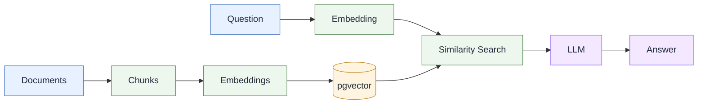

# RAG AWS SAA

A **Retrieval-Augmented Generation (RAG)** API built with **.NET 10, PostgreSQL, pgvector, and OpenAI**.

I chose **RonitSachdev’s AWS SAA-C03 Guides** as the corpus because I found them helpful while preparing for and passing the certification. The guides are licensed under **CC BY 4.0**; see the [original repository](https://github.com/RonitSachdev/aws-saa-c03-guides) and [LICENSE](https://github.com/RonitSachdev/aws-saa-c03-guides/blob/main/LICENSE).

## How It Works

1. **Read** — Load Markdown documents.
2. **Chunk** — Split documents into smaller sections.
3. **Embed** — Generate OpenAI vector embeddings.
4. **Store** — Save chunks and embeddings in PostgreSQL + pgvector.
5. **Retrieve** — Find relevant chunks using vector similarity.
6. **Generate** — Send retrieved context to an LLM.



## API

```text
GET /ingest
GET /search?q=...
GET /ask?q=...
```

`/ingest` clears existing chunks and re-ingests the document corpus.

## Environment Variables

```bash
export ConnectionStrings__RagDatabase='...'
export OPENAI_API_KEY='...'
```

## Author

Jorge Donoso
